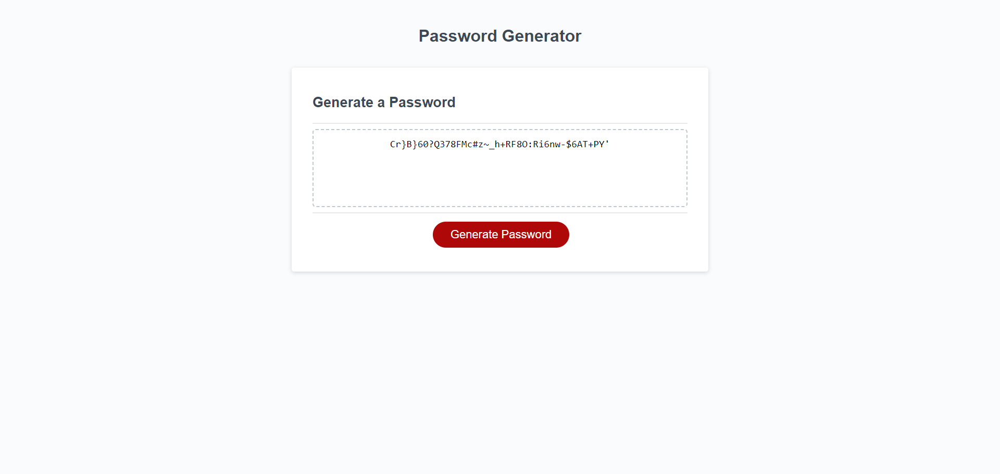

# Password-Generator 
Created an app that runs in the browser and features dynamically updated HTML and CSS, all powered by JavaScript code that i wrote. The app will have a clean and polished user interface that is responsive, ensuring that it adapts to multiple screen sizes. This random password generator gives you a password length between 8-128 characters that includes uppercase,lowercase,numeric and special characters. You can pick however many different character sets you want but you must have at least one.

## Installation

Theres no installation required, this is a standard HTML, CSS file with a javascript file.

    
## Usage/Examples

 

## Credits

freecodecamp.org/news/how-to-write-better-git-commit-messages/
- mozzilla developer - https://developer.mozilla.org
- https://developer.mozilla.org
- https://owasp.org/www-community/password-special-characters
- https://edabit.com/challenge/ARr5tA458o2tC9FTN
- https://www.youtube.com/watch?v=duNmhKgtcsI
## License

[MIT](https://choosealicense.com/licenses/mit/)

